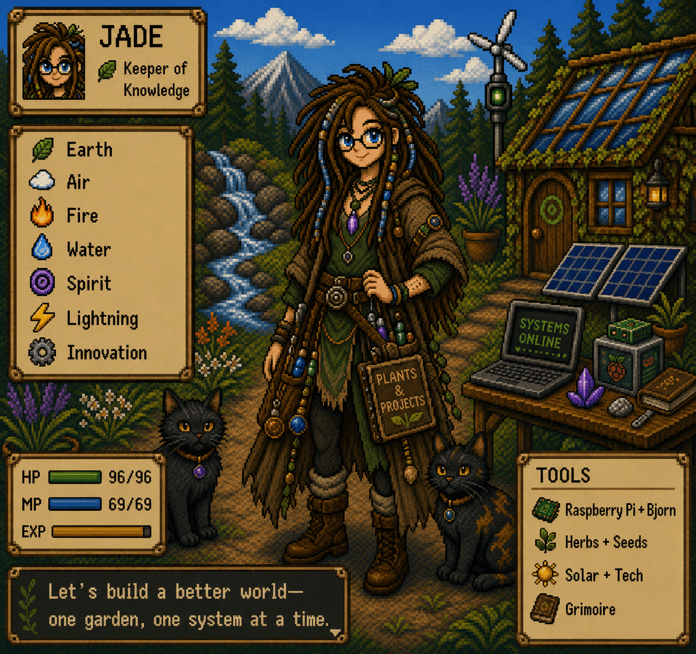

──────────────────────────────────────

                JADE

 Keeper of Knowledge
 Software Developer
 Web Designer
 Game Developer

──────────────────────────────────────

────────────────────────────────────────────────────────────────────────────
# 🌿 About Me

Hi! I'm Jade.

I'm currently studying Software Development while building websites, games,
AI projects, Raspberry Pi clusters, and eventually a tiny homestead.

I enjoy creating software that solves real problems while staying creative.
────────────────────────────────────────────────────────────────────────────

## Character Stats

HP  ████████████ 96/96
MP  ████████████ 69/69
EXP ███████░░░░ Student

────────────────────────────────────────────────────────────────────────────

## Elemental Affinities

🍃 Earth

☁ Air

🔥 Fire

💧 Water

🌀 Spirit

⚡ Lightning

⚙ Innovation

────────────────────────────────────────────────────────────────────────────

💻 VS Code

🐧 Linux

🍓 Raspberry Pi

🤖 AI

🌱 Gardening

📚 Research

☕ Coffee

────────────────────────────────────────────────────────────────────────────
